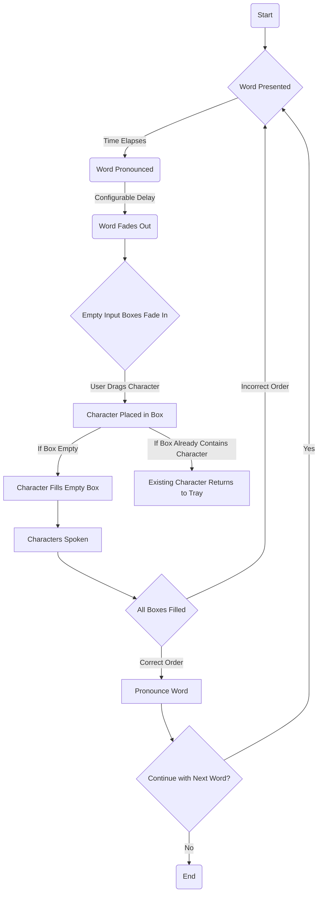

# User Flow

Here's a breakdown of the user flow:

```yml
Start: The user starts the app.
Word Presented: A new word is displayed to the user.
Word Pronounced: The app pronounces the word using text-to-speech.
Word Fades Out: After a configurable delay, the word fades out from the screen.
Input Boxes Empty: Input boxes fade in corresponding to the number of letters in the word, and the character tray fades in with all the characters needed for the word plus 50% more random characters.
Character Placed in Box: The user drags a character chip into one of the input boxes.
Character Stays in Box: The characters in the boxes are combined into a string with blank boxes parsed as spaces.
Character String is Spoken: The character string is spoken.
Character Returns to Tray: If the character is replaced by another character, it returns to the character tray.
All Boxes Filled: The user has filled all the input boxes.
Word Spoken: The app pronounces the full word.
Incorrect Order: If the characters are not in the correct order, the original word fades in again for 2 seconds.
Continue with Next Word?: The user decides whether to continue with a new word or end the session.
End: The user ends the session.
```

